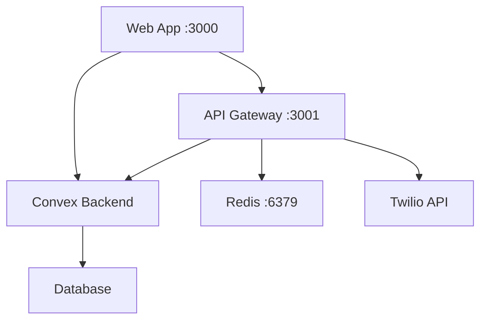

# Computer Guys Chatbot - Complete Startup Guide

**Quick reference for starting all services in the Computer Guys chatbot monorepo**

---

## 📋 Prerequisites

Ensure you have the following installed:
- Node.js v20+ 
- PNPM v8+
- Git
- Docker (optional, for Redis)

---

## 🚀 Quick Start - All Services

### Step 1: Install Dependencies (First Time Only)

```bash
# From project root (C:\Users\domi\Desktop\cg-chat)
pnpm install
```

### Step 2: Start All Services

You'll need **3 separate terminal windows**:

#### Terminal 1: Convex Backend
```bash
# Navigate to Convex package
cd packages/convex

# Start Convex development server
pnpm convex dev

# Expected output:
# ✔ Convex functions ready! (2.42s)
# Watching for changes...
```

#### Terminal 2: API Gateway
```bash
# Navigate to API directory
cd apps/api

# Start Hono API server
pnpm dev

# Expected output:
# 🚀 API Server starting...
# 📦 Environment: development
# ✅ API Server running at http://localhost:3001
```

#### Terminal 3: Next.js Web Application
```bash
# Navigate to web directory
cd apps/web

# Start Next.js development server
pnpm dev

# Expected output:
# ▲ Next.js 15.1.7
# Local: http://localhost:3000
# ✓ Starting...
# ✓ Ready in 2s
```

---

## 📁 Service Locations & Ports

| Service | Directory | Port | URL |
|---------|-----------|------|-----|
| **Convex Backend** | `packages/convex` | - | https://dashboard.convex.dev |
| **API Gateway** | `apps/api` | 3001 | http://localhost:3001 |
| **Web Application** | `apps/web` | 3000 | http://localhost:3000 |
| **Redis** (optional) | Docker | 6379 | localhost:6379 |

---

## 🔧 Detailed Service Commands

### Convex Backend Commands

```bash
cd packages/convex

# Development mode (watches for changes)
pnpm convex dev

# Deploy to production
pnpm convex deploy

# Open Convex dashboard
pnpm convex dashboard

# View logs
pnpm convex logs

# Run Convex codegen (generate types)
pnpm convex codegen
```

### API Gateway Commands

```bash
cd apps/api

# Development mode with hot reload
pnpm dev

# Build for production
pnpm build

# Start production server
pnpm start

# Type checking
pnpm type-check

# Linting
pnpm lint

# Run tests
pnpm test

# Docker commands
pnpm docker:build     # Build Docker image
pnpm docker:run       # Run in Docker
docker-compose up     # Start with Redis
```

### Web Application Commands

```bash
cd apps/web

# Development mode with hot reload
pnpm dev

# Build for production
pnpm build

# Start production server
pnpm start

# Type checking
pnpm type-check

# Linting
pnpm lint

# Format code
pnpm format
```

---

## 🐳 Optional: Redis for Rate Limiting

### Option 1: Using Docker Compose (Recommended)
```bash
cd apps/api

# Start Redis with Docker Compose
docker-compose up -d redis

# Stop Redis
docker-compose down
```

### Option 2: Using Docker Directly
```bash
# Run Redis container
docker run -d \
  --name cg-redis \
  -p 6379:6379 \
  redis:alpine

# Stop Redis
docker stop cg-redis
docker rm cg-redis
```

### Option 3: Native Installation
- **Windows**: Download from https://github.com/microsoftarchive/redis/releases
- **Mac**: `brew install redis`
- **Linux**: `sudo apt-get install redis-server`

---

## 🔍 Health Checks & Testing

### Check Service Status

#### Convex Health
```bash
# Check Convex dashboard
open https://dashboard.convex.dev/d/dazzling-wolverine-821
```

#### API Health
```bash
# Basic health check
curl http://localhost:3001/health

# Detailed health check
curl http://localhost:3001/health/detailed

# Metrics
curl http://localhost:3001/health/metrics
```

#### Web Application
```bash
# Open in browser
open http://localhost:3000

# Or check with curl
curl http://localhost:3000
```

---

## 🛠️ Development Workflow

### Standard Development Setup
```bash
# Terminal 1: Backend
cd packages/convex && pnpm convex dev

# Terminal 2: API
cd apps/api && pnpm dev

# Terminal 3: Frontend
cd apps/web && pnpm dev

# Terminal 4: Redis (optional)
docker run -p 6379:6379 redis:alpine
```

### Quick Commands from Root
```bash
# Install all dependencies
pnpm install

# Type check everything
pnpm type-check

# Lint all packages
pnpm lint

# Format all code
pnpm format

# Build all packages
pnpm build
```

---

## 🔧 Environment Setup

### API Environment (.env)
```bash
cd apps/api
cp .env.example .env
# Edit .env with your values
```

### Web Environment (.env.local)
```bash
cd apps/web
cp .env.example .env.local
# Edit .env.local with your values
```

### Required Environment Variables

#### API (.env)
```env
NODE_ENV=development
PORT=3001
CONVEX_URL=https://your-deployment.convex.cloud
JWT_SECRET=your-secret-key
JWT_REFRESH_SECRET=your-refresh-secret
REDIS_HOST=localhost
REDIS_PORT=6379
```

#### Web (.env.local)
```env
NEXT_PUBLIC_CONVEX_URL=https://your-deployment.convex.cloud
NEXT_PUBLIC_API_URL=http://localhost:3001
```

---

## 🚨 Troubleshooting

### Port Already in Use
```bash
# Find process using port (Windows)
netstat -ano | findstr :3000
taskkill /PID <PID> /F

# Find process using port (Mac/Linux)
lsof -i :3000
kill -9 <PID>
```

### PNPM Store Issues (WSL)
```bash
# Clear and reinstall
rm -rf node_modules pnpm-lock.yaml
pnpm install
```

### Convex Connection Issues
```bash
# Re-authenticate
cd packages/convex
npx convex dev --configure

# Clear cache
rm -rf .convex
npx convex dev
```

### Redis Connection Errors
- The API works without Redis (graceful fallback)
- Rate limiting will be disabled without Redis
- To fix: Start Redis using Docker or native installation

---

## 📊 Service Dependencies



---

## 🔄 Shutdown Services

### Graceful Shutdown
1. Press `Ctrl+C` in each terminal
2. Wait for graceful shutdown message
3. Close terminal windows

### Force Shutdown (if needed)
```bash
# Windows
taskkill /F /IM node.exe

# Mac/Linux
killall node
```

### Docker Cleanup
```bash
# Stop all containers
docker-compose down

# Remove volumes
docker-compose down -v

# Clean everything
docker system prune -a
```

---

## 📱 Mobile Development

### Accessing from Mobile Device

1. Find your local IP:
```bash
# Windows
ipconfig

# Mac/Linux
ifconfig
```

2. Update API CORS:
```env
# apps/api/.env
ALLOWED_ORIGINS=http://localhost:3000,http://YOUR_IP:3000
```

3. Access from mobile:
- Web: `http://YOUR_IP:3000`
- API: `http://YOUR_IP:3001`

---

## 🚀 Production Deployment

### Build for Production

```bash
# Build everything
pnpm build

# Build specific service
cd apps/api && pnpm build
cd apps/web && pnpm build
```

### Start Production Servers

```bash
# Convex (already deployed)
cd packages/convex
pnpm convex deploy --prod

# API
cd apps/api
NODE_ENV=production pnpm start

# Web
cd apps/web
pnpm build && pnpm start
```

---

## 📝 Quick Reference Card

```bash
# Start everything (3 terminals)
cd packages/convex && pnpm convex dev    # Terminal 1
cd apps/api && pnpm dev                  # Terminal 2  
cd apps/web && pnpm dev                  # Terminal 3

# Optional Redis
docker run -p 6379:6379 redis:alpine     # Terminal 4

# Access points
http://localhost:3000  # Web App
http://localhost:3001  # API
http://localhost:3001/health  # API Health

# Stop everything
Ctrl+C in each terminal
```

---

## 🔗 Useful Links

- **Convex Dashboard**: https://dashboard.convex.dev
- **API Health**: http://localhost:3001/health
- **Web App**: http://localhost:3000
- **API Docs**: http://localhost:3001/api-docs (future)

---

## 📞 Support & Help

### Check Logs
```bash
# Convex logs
cd packages/convex && pnpm convex logs

# API logs (in terminal output)
# Web logs (in terminal output + browser console)
```

### Debug Mode
```bash
# API with debug
DEBUG=* cd apps/api && pnpm dev

# Web with verbose
cd apps/web && NEXT_PUBLIC_DEBUG=true pnpm dev
```

---

*Last Updated: January 2025*  
*Version: 1.0.0*  
*Project: Computer Guys Chatbot*